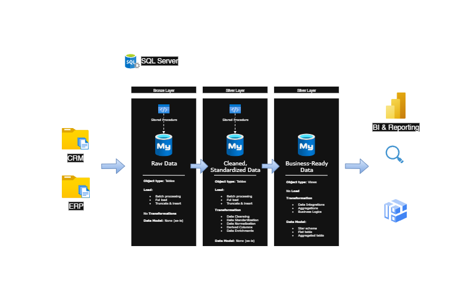

# Data Warehouse and Analytics Project

Welcome to my first SQL project from **Data With Baraa** big shoutout to him for make the course 100% free. You can access the tutorial from link that I attached in the end.
This **Data Warehouse and Analytics Project** demonstrates a comprehensive data warehouse. Designed as a portfolio project, it highlights industry best practices in data engineering and analytics.

---
## 🏗️ Data Architecture
The data architecture for this project follows Medallion Architecture that consist **Bronze**, **Silver**, and **Gold** layers:

