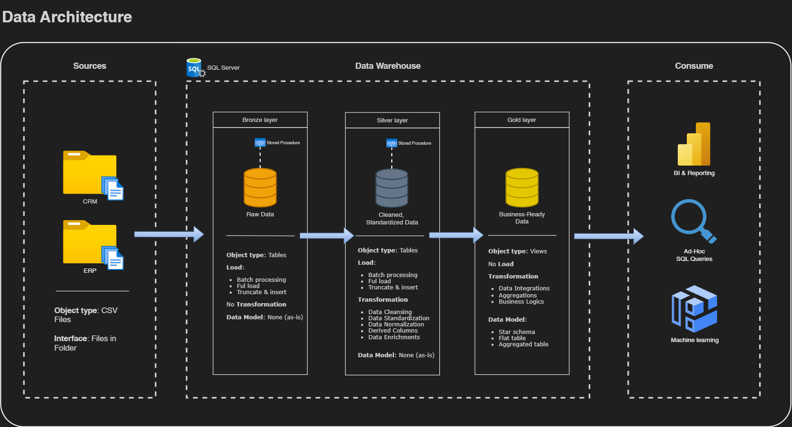

# Data Warehouse and Analytics Project

Welcome to my first SQL project from **Data With Baraa** big shoutout to him for make the course 100% free. You can access the tutorial from link that I attached in the end.
This **Data Warehouse and Analytics Project** demonstrates a comprehensive data warehouse. Designed as a portfolio project, it highlights industry best practices in data engineering and analytics.
This project include a three phase work, starting from SQL Datawarehouse, Exploratory Data Analysis (EDA), and Advanced Data Analytics.

---
## 🏗️ Data Architecture
The data architecture for this project follows Medallion Architecture that consist **Bronze**, **Silver**, and **Gold** layers:

1. Bronze Layer: Stores raw data as-is from the source systems. Data is coming from CSV files into SQL Server Database.
2. Silver Layer: This layer includes data cleansing, standardization and normalization processes to prepare the data for analysis
3. Gold Layer: Houses business-ready data modeled into star schema required for reporting and analytics.

---
## 📖 Project Overview
This projects is containing:

1. Data Architecture: Designing a Modern Data Warehouse Using Medallion Architecture Bronze, Silver, and Gold Layers.
2. ETL Pipelines: Extracting, transforming, and loading data from the system into the warehouse.
3. Analytics and Reporting: Creating SQL-based reports and dashboard for actionable insights.

🎯In this project as the sources mentioned, I want to showcase expertise in:
- SQL Development
- Data Architect
- Data Engineering
- ETL Pipeline Developer
- Data Modeling
- Data Analytics

---

## 🛠️ Tools that are used in this project
- **[Datasets](datasets/):** Access to the project dataset (csv files).
- **[SQL Server Express](https://www.microsoft.com/en-us/sql-server/sql-server-downloads):** Lightweight server for hosting your SQL database.
- **[SQL Server Management Studio (SSMS)](https://learn.microsoft.com/en-us/ssms/install/install):** GUI for managing and interacting with databases.
- **[Git_Repository](https://github.com/):** Set up a GitHub account and repository to manage, version, and collaborate on your code efficiently.
- **[DrawIO](https://www.drawio.com/):** Design diagram data architecture, models, and flows
- **[Notion](https://www.notion.com/):** Make the planning by notion
- **[Notion](https://thankful-pangolin-2ca.notion.site/SQL-Data-Warehouse-Project-16ed041640ef80489667cfe2f380b269?pvs=4):** Notion template planning by Data with Baraa

---

## 🚀 Project Requirement

### Building the Data Warehouse (Data Engineering)

#### Objective
 
